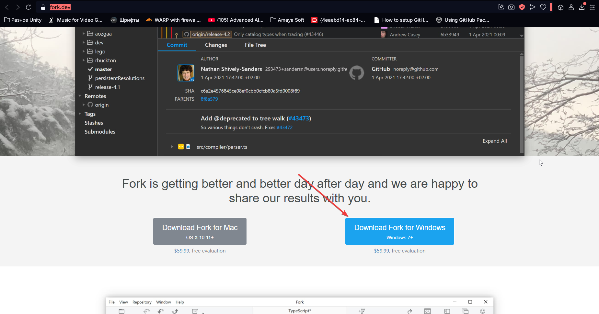
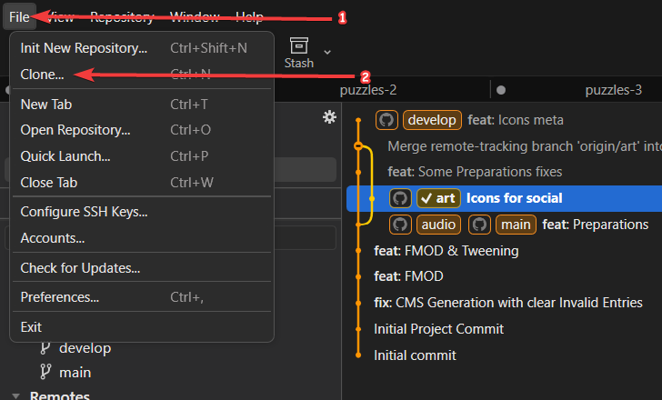
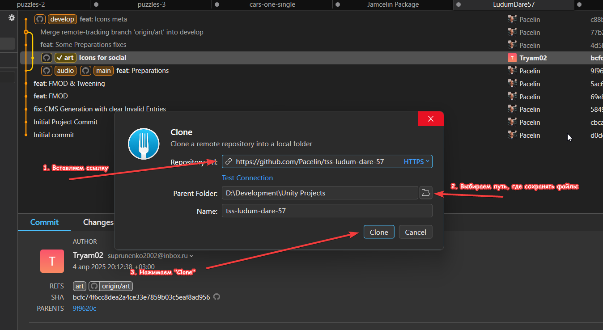
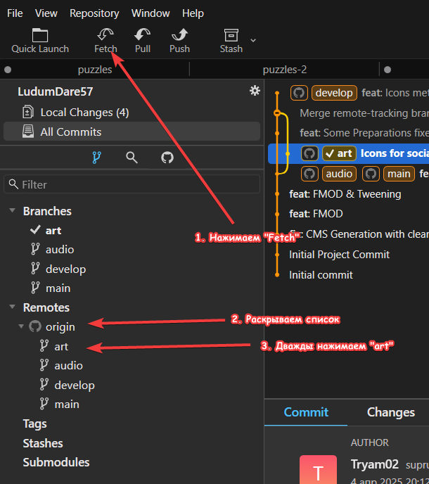
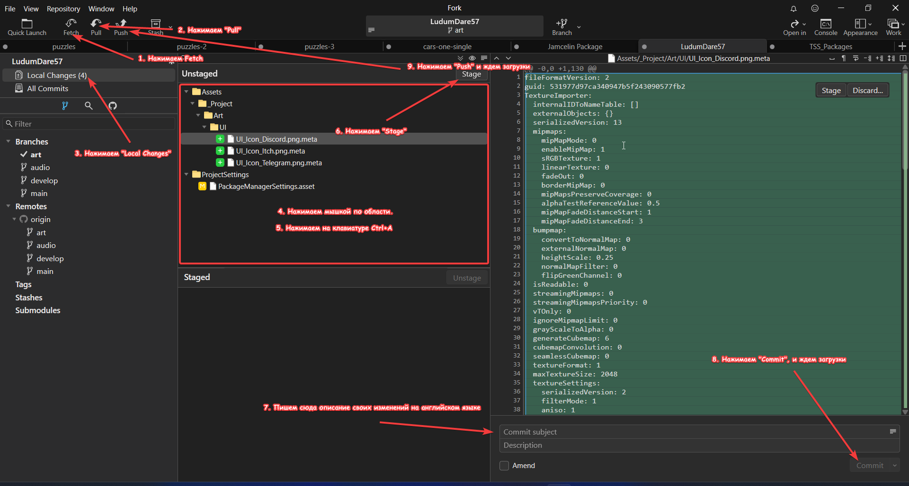

# Инструкция по Fork
## Установка
1. Переходим по ссылке: https://fork.dev
2. Скачиваем Fork и устанавливаем по инструкции:

## Клонирование репозитория
1. Переходим по полученной ссылке на Git, принимаем приглашение, копируем ссылку на  репозиторий (например: https://github.com/Pacelin/siberian25).
2. Заходим в Fork и нажимаем "File > Clone...":

3. После выбираем адрес репозитория, папку с проектами и название папки проекта:

4. Ждем загрузки и делаем следующее:

## Выгрузка файлов
1. Заходим в папку, куда сохранили проект. Там ищем свою папку (пример: `Assets/_Project/Art`). Закидываем туда все нужные файлы.
2. Загружаем изменения.

