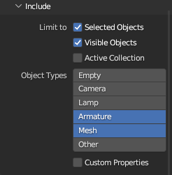
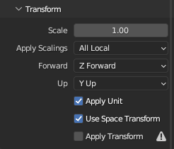
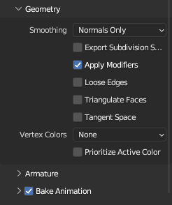

# Экспорт ассетов
## 3D
- Формат файлов: `.fbx`

Экспортировать нужно только меши. Камеры, освещение и прочие объекты сцены Blender можно использовать для работы над ассетом, но экспортировать их не надо.

### Рекомендуемые настройки экспорта моделей
Перед экспортом модели лучше объединить все её части в один меш в целях производительности Unity.

**Окно экспорта файла в формате `.fbx`:**

 

Если анимаций нет:
- `Bake Animation` = ВЫКЛ
- `Object Types` `Armature` = ВЫКЛ

## Текстуры
- Формат файлов: `.png`, `.psd`

### Спрайты
- `PPI (Pixels Per Inch)` = `72`

Если экспортируется набор спрайтов с анимацией, на разных кадрах центр анимируемого объекта должен быть в одном месте.

### VFX

Есть два основных вида спрайтов для VFX:
1. Alpha
2. Additive

Для Additive, как правило, экспортировать a-канал необязательно. Спрайты VFX экспортируются в чёрно-белом варианте, если не сказано обратное.

Если спрайт эффекта анимируемый (например, дым в несколько кадров), есть смысл весь эффект импортировать одним изображением.

## Аудио
### FMOD
#todo Экспорт FMOD 

## Локализация
Работа с локализацией происходит в таблице *Google Docs*. Структура таблицы может выглядеть примерно так:

| key              | ru                | en             | **comment** |
| ---------------- | ----------------- | -------------- | ----------- |
| loot.desert.0    | Сундук пиратов    | Treasure chest |             |
| loot.desert.1    | Руда              | Raw ore        |             |
| loot.waterfall.0 | Раковина моллюска | Clamshell      |             |
| loot.waterfall.1 | Древо-цветок      | Elderbloom     |             |
| loot.crystal.0   | Кристалл          | Crystal        |             |
| loot.crystal.1   | Вагонетка         | Minecart       |             |

Таблица экспортируется в формате `.csv`

### Рекомендации по локализации
- Поле `key` оформляется словами на английском языке через точку (в отличие от ассетов, которые разделяются символов `_`). Пример: `loot.desert.0`
- В названиях из нескольких слов на русском языке большая буква есть только у первого слова и всех имён собственных. Пример: *"Нечто из глубин"*
- В названиях из нескольких слов на английском языке большая буква есть у всех слов, кроме служебных (частицы, предлоги). Пример: *"Something from the Deep"*
- Поле `comment` необязательно и нужно для доп. информации для разработчиков
- Пустые поля во время разработки перед экспортом нужно заполнить любым значением. Например: "n/a" (Not Available)
- Для кавычек на русском языке рекомендуется использовать «ёлочки». На английском языке рекомендуется использовать "лапки"